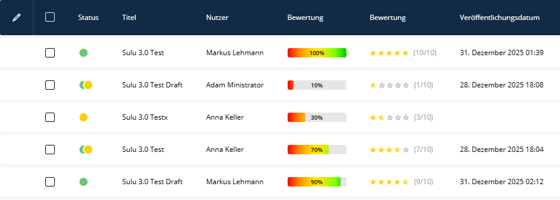
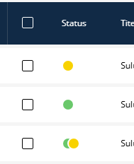
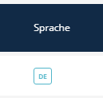
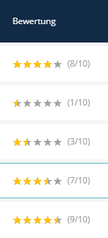
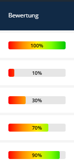

# SuluTweaksBundle

[](https://github.com/manuxi/SuluTweaksBundle/LICENSE)

[](https://sulu.io/)

[](https://php.net/)

**Deutsche Version** | [English Version](README.md)

Dieses Bundle wurde erstellt, um einige Aspekte der Listendarstellung von Sulu anzupassen oder zu erweitern.

Dieses Bundle funktioniert für Sulu 2.6 (wahrscheinlich auch mit früheren Versionen) und 3.0. Benutzung auf eigene Gefahr 🤞🏻

---

## Features



### 🔴 Publish State Indicator

Treppeneffekte in Listen sind unschön, und die Standard-Darstellung produziert eben diese.

Dieses Bundle räumt damit auf: Das enthaltene SCSS blendet die aktuellen Publish-Indikatoren und Ghost-Locale aus und fügt neue in eigenen Spalten hinzu. Dabei hat der PublishIndicator bei einem publizierten Element auch einen grünen Punkt.

| Status               | Farbe            |
|----------------------|------------------|
| Veröffentlicht       | 🟢 Grün          |
| Entwurf              | 🟢🟡 Grün + Gelb |
| Nicht veröffentlicht | 🟡 Gelb          |



### 🌐 Ghost Locale Indicator

Sulus eingebauter Ghost-Locale-Indikator (zeigt die Fallback-Sprache) wird automatisch zu Zellen hinzugefügt und kann nicht verschoben werden. Dieses Bundle bietet eine separate Spalte für die Ghost-Locale, die beliebig in Listen platziert werden kann.

Das Styling entspricht dem Original-Design von Sulu.



### ⭐ Star Rating

Zeigt numerische Bewertungen als visuelle Sterne an. Unterstützt sowohl 5-Punkte- als auch 10-Punkte-Skalen (mit halben Sternen).

| Bewertung | Anzeige              |
|-----------|----------------------|
| 3/5       | ★★★☆☆                |
| 7/10      | ★★★⯪☆ (halber Stern) |

Der numerische Wert wird beim Hovern im Tooltip angezeigt. Optional kann der Wert auch neben den Sternen angezeigt werden.



### 📊 Percent Bar

Zeigt Werte als farbigen Fortschrittsbalken an. Die Farbe wechselt von Rot (0%) über Orange, Gelb zu Grün (100%).

| Prozent | Farbe       |
|---------|-------------|
| 0-20%   | 🔴 Rot      |
| 20-40%  | 🟠 Orange   |
| 40-60%  | 🟡 Gelb     |
| 60-80%  | 🟢 Hellgrün |
| 80-100% | 🟢 Grün     |

**Features:**
- **max_value**: Beliebige Skalen (0-100, 0-10, 0-5, etc.) - global oder per XML-Parameter
- **value_position**: Wert im Balken (`inside`), rechts daneben (`outside`) oder versteckt (`none`)
- **gradient_mode**: Fließender Verlauf (`interpolate`) oder Farbstufen (`steps`)
- **use_gradient**: Farbverlauf oder einzelne Farbe
- **animate**: CSS-Animation beim Laden



---

## 👩🏻‍🏭 Installation

### Schritt 1: Paket installieren

```console
composer require manuxi/sulu-tweaks-bundle
```

### Schritt 2: Admin-Assets registrieren

In `assets/admin/package.json` hinzufügen:

```json
{
    "dependencies": {
        "sulu-tweaks-bundle": "file:../../vendor/manuxi/sulu-tweaks-bundle/src/Resources"
    }
}
```

### Schritt 3: Bundle importieren

In `assets/admin/app.js` importieren:

```javascript
import 'sulu-tweaks-bundle';
```

### Schritt 4: Admin-Assets neu bauen

```bash
cd assets/admin
npm install
npm run build
```

---

## 🔧 Wie es funktioniert

Beim Import des Bundles über `import 'sulu-tweaks-bundle';` passiert automatisch folgendes:

1. **Configuration Hook**: Das Bundle registriert einen Update-Config-Hook für `sulu_tweaks`
2. **Transformer-Registrierung**: Alle List-Field-Transformer werden in Sulus `listFieldTransformerRegistry` registriert
3. **Styles angewendet**: Das enthaltene SCSS blendet Sulus Standard-Indikatoren/Ghost-Locales aus und wendet eigenes Styling an

### Verfügbare Transformer

| Transformer                    | Type-Name                 | Beschreibung                               |
|--------------------------------|---------------------------|--------------------------------------------|
| `PublishStateFieldTransformer` | `publish_state_indicator` | Farbige Punkte für Veröffentlichungsstatus |
| `GhostLocaleFieldTransformer`  | `ghost_locale_indicator`  | Separate Spalte für Fallback-Sprache       |
| `StarRatingFieldTransformer`   | `star_rating`             | Sternebewertungs-Anzeige                   |
| `PercentBarFieldTransformer`   | `percent_bar`             | Farbiger Prozent-Balken                    |

Es müssen nur die Transformer, die verwendet werden sollen, zu den Listen-XML-Konfigurationen hinzugefügt werden.

---

## 📋 Verwendung

### Publish State Indicator

In der Listen-XML hinzufügen (z.B. `config/lists/events.xml`):

```xml
<property name="publishedState" translation="sulu_tweaks.published" visibility="always">
    <field-name>publishedState</field-name>
    <entity-name>%sulu.model.event_translation.class%</entity-name>
    <joins ref="translation"/>

    <transformer type="publish_state_indicator"/>
</property>
```

**Tipp:** Diese Property am Anfang der Liste platzieren für bessere Sichtbarkeit.

### Ghost Locale Indicator

In der Listen-XML hinzufügen:

```xml
<property name="ghostLocale" translation="sulu_tweaks.ghost_locale" visibility="always">
    <field-name>ghostLocale</field-name>

    <transformer type="ghost_locale_indicator"/>
</property>
```

**Hinweis:** Das Feld `ghostLocale` muss in den Listendaten verfügbar sein. Bei Sulu 3.0 DimensionContent-Architektur wird dieses Feld normalerweise automatisch bereitgestellt.

### Star Rating

In der Listen-XML hinzufügen:

```xml
<property name="rating" translation="app.rating" visibility="always">
    <field-name>rating</field-name>

    <transformer type="star_rating"/>
</property>
```

#### Mit XML-Parametern (überschreibt globale Config):

```xml
<property name="rating" translation="app.rating" visibility="always">
    <field-name>rating</field-name>

    <transformer type="star_rating">
        <params>
            <param name="max_value" value="10"/>
            <param name="show_value" value="false"/>
        </params>
    </transformer>
</property>
```

### Percent Bar

In der Listen-XML hinzufügen:

```xml
<property name="progress" translation="app.progress" visibility="always">
    <field-name>progress</field-name>

    <transformer type="percent_bar"/>
</property>
```

#### Verschiedene Skalen per XML-Parameter:

```xml
<!-- 0-10 Skala -->
<property name="rating" translation="app.rating" visibility="always">
    <field-name>rating</field-name>

    <transformer type="percent_bar">
        <params>
            <param name="max_value" value="10"/>
        </params>
    </transformer>
</property>
```
```xml
<!-- 0-5 Skala mit Wert im Balken -->
<property name="score" translation="app.score" visibility="always">
    <field-name>score</field-name>

    <transformer type="percent_bar">
        <params>
            <param name="max_value" value="5"/>
            <param name="value_position" value="inside"/>
        </params>
    </transformer>
</property>
```
```xml
<!-- Farbstufen statt fließendem Verlauf -->
<property name="progress" translation="app.progress" visibility="always">
    <field-name>progress</field-name>

    <transformer type="percent_bar">
        <params>
            <param name="gradient_mode" value="steps"/>
        </params>
    </transformer>
</property>
```
```xml
<!-- Einzelne Farbe ohne Animation -->
<property name="completion" translation="app.completion" visibility="always">
    <field-name>completion</field-name>

    <transformer type="percent_bar">
        <params>
            <param name="use_gradient" value="false"/>
            <param name="color" value="#3498db"/>
            <param name="animate" value="false"/>
        </params>
    </transformer>
</property>
```

---

## 🧶 Konfiguration

`config/packages/sulu_tweaks.yaml` im Projekt erstellen:

```yaml
sulu_tweaks:
    publish_state_indicator:
        # Offset aktivieren wenn ghost_locale_indicator nicht als separate Spalte verwendet wird
        enable_offset: false
        # offset_width: 28

    star_rating:
        # Numerischen Wert neben Sternen anzeigen (z.B. "★★★☆☆ (3/5)")
        show_value: true
        # Maximaler Bewertungswert (5 oder 10) - per XML-Parameter überschreibbar
        max_value: 5

    percent_bar:
        # Prozentwert anzeigen
        show_value: true
        # Position: 'inside' (im Balken), 'outside' (rechts), 'none' (versteckt)
        value_position: outside
        # Maximalwert für Berechnung - per XML-Parameter überschreibbar
        # Beispiele: 100 für 0-100%, 10 für 0-10 Skala, 5 für 0-5 Skala
        max_value: 100
        # Farbverlauf oder einzelne Farbe
        use_gradient: true
        # Verlaufsmodus: 'interpolate' (fließend) oder 'steps' (Farbstufen)
        gradient_mode: interpolate
        # Einzelne Farbe wenn use_gradient: false
        color: '#52b6ca'
        # Balken beim Laden animieren
        animate: true
```

### Konfiguration vs. XML-Parameter

| Option    | Global (YAML)    | Per Liste (XML)         |
|-----------|------------------|-------------------------|
| Gilt für  | Alle Listen      | Einzelne Property       |
| Priorität | Niedriger        | Höher (überschreibt)    |
| Anwendung | Projekt-Defaults | Spezielle Anforderungen |

**Beispiel:** Global `max_value: 100`, aber eine Liste braucht `max_value: 10` → per XML-Parameter überschreiben.

---

## 🗣️ Übersetzungen

Das Bundle liefert Übersetzungen für Englisch und Deutsch. Sie können im Projekt überschrieben werden:

```yaml
# translations/admin.en.yaml
sulu_tweaks:
    draft: "Draft"
    published: "Published"
    not_published: "Not published"
    ghost_locale: "Language"
```

```yaml
# translations/admin.de.yaml
sulu_tweaks:
    draft: "Entwurf"
    published: "Veröffentlicht"
    not_published: "Nicht veröffentlicht"
    ghost_locale: "Sprache"
```

---

## 📁 Bundle-Struktur

```
SuluTweaksBundle/
├── src/
│   ├── Admin/
│   │   └── TweaksAdmin.php
│   ├── DependencyInjection/
│   │   ├── Configuration.php
│   │   └── SuluTweaksBundleExtension.php
│   ├── Resources/
│   │   ├── config/
│   │   │   ├── packages/sulu_tweaks.yaml
│   │   │   └── services.xml
│   │   ├── js/
│   │   │   ├── fieldTransformers/
│   │   │   │   ├── PublishStateFieldTransformer.js
│   │   │   │   ├── PublishStateFieldTransformer.scss
│   │   │   │   ├── GhostLocaleFieldTransformer.js
│   │   │   │   ├── GhostLocaleFieldTransformer.scss
│   │   │   │   ├── StarRatingFieldTransformer.js
│   │   │   │   ├── StarRatingFieldTransformer.scss
│   │   │   │   ├── PercentBarFieldTransformer.js
│   │   │   │   └── PercentBarFieldTransformer.scss
│   │   │   └── index.js
│   │   ├── translations/
│   │   │   ├── admin.de.yaml
│   │   │   └── admin.en.yaml
│   │   └── package.json
│   └── SuluTweaksBundle.php
└── README.md
```

---

## 🤝 Mitwirken

Beiträge sind willkommen! Pull Requests können gerne eingereicht werden.

---

## 📄 Lizenz

Dieses Bundle steht unter der MIT-Lizenz.