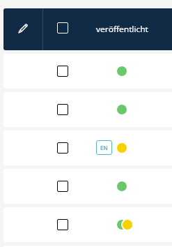

# SuluTweaksBundle
[](https://github.com/manuxi/SuluTweaksBundle/LICENSE)


I made this bundle to tweak some aspects of Sulu.

Please feel comfortable submitting feature requests.

This bundle is still in development. Use at own risk 🤞🏻

### Lists: Publish dots

I don't like stairs in lists, so I created another listTransformer. For me it's better scannable now. 

The included scss hides the current publish indicators and adds new ones (also with a green one for published elements).

The draft functionality is given but untested.



Is there more? Perhaps soon...

## 👩🏻‍🏭 Installation

Install the package with:
```console
composer require manuxi/sulu-tweaks-bundle
```

Add the resources to your assets/admin/package.json
```json
"dependencies": {
    "sulu-tweaks-bundle": "../../vendor/manuxi/sulu-tweaks-bundle/src/Resources/"
}
```
...then add the components to the assets/admin/app.js
```javascript
import {PublishStateFieldTransformer} from 'sulu-tweaks-bundle/js';
listFieldTransformerRegistry.add('publish_state_indicator', new PublishStateFieldTransformer());
```

Rebuild admin sources:
```bash
    cd assets/admin
    npm install
    npm run build
```

Then add the publish_state_indicator to your list(s) in project/bundle
```xml
<property name="publishedState" translation="sulu_event.published" visibility="never">
    <field-name>publishedState</field-name>
    <entity-name>%sulu.model.event_translation.class%</entity-name>
    <joins ref="translation"/>

    <transformer type="publish_state_indicator" />
</property>
```

(I made also sure that this row is at the beginning of the list)


