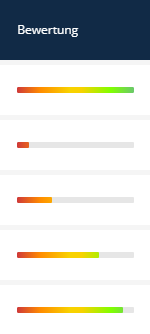
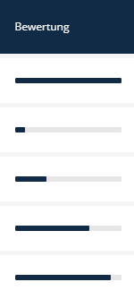

# SuluTweaksBundle

[](https://github.com/manuxi/SuluTweaksBundle/LICENSE)

[](https://sulu.io/)

[](https://php.net/)

**English** | [Deutsche Version](README.de.md)

This bundle was created to tweak some aspects of Sulu's list display.

Feature requests are always welcome.

This bundle works for Sulu 2.6 (probably earlier too) and 3.0. Use at own risk 🤞🏻

---

## Features


### 🔴 Publish State Indicator

Stair effects in lists are ugly, and the default display produces exactly those.

This bundle cleans that up: The included SCSS hides the current publish indicators and ghost locale and adds new ones in separate columns. The PublishIndicator also shows a green dot for published elements.

| Status        | Color               |
|---------------|---------------------|
| Published     | 🟢 Green            |
| Draft         | 🟢🟡 Green + Yellow |
| Not published | 🟡 Yellow           |


### 🌐 Ghost Locale Indicator

Sulu's built-in ghost locale indicator (showing the fallback language) is automatically added to cells and cannot be repositioned. This bundle provides a separate column for the ghost locale that can be placed anywhere in lists.

The styling matches Sulu's original design.


### ⭐ Star Rating

Displays numeric ratings as visual stars. Supports both 5-point and 10-point scales (with half-stars).

| Rating | Display              |
|--------|----------------------|
| 3/5    | ★★★☆☆                |
| 7/10   | ★★★⯪☆ (half star)    |

The numeric value is shown in a tooltip on hover. Optionally, the value can also be displayed next to the stars.


### 📊 Percent Bar

Displays values as a colored progress bar. The color transitions from red (0%) through orange, yellow to green (100%).

| Percent | Color          |
|---------|----------------|
| 0-20%   | 🔴 Red         |
| 20-40%  | 🟠 Orange      |
| 40-60%  | 🟡 Yellow      |
| 60-80%  | 🟢 Light green |
| 80-100% | 🟢 Green       |

**Features:**
- **max_value**: Any scale (0-100, 0-10, 0-5, etc.) - globally or per XML parameter
- **value_position**: Value inside the bar (`inside`), to the right (`outside`) or hidden (`none`)
- **gradient_mode**: Smooth transition (`interpolate`) or color bands (`steps`)
- **use_gradient**: Gradient colors or single color
- **animate**: CSS animation on load





---

## 👩🏻‍🏭 Installation

### Step 1: Install the package

```console
composer require manuxi/sulu-tweaks-bundle
```

### Step 2: Register Admin Assets

Add to `assets/admin/package.json`:

```json
{
    "dependencies": {
        "sulu-tweaks-bundle": "file:../../vendor/manuxi/sulu-tweaks-bundle/src/Resources"
    }
}
```

### Step 3: Import the Bundle

Import in `assets/admin/app.js`:

```javascript
import 'sulu-tweaks-bundle';
```

### Step 4: Rebuild Admin Assets

```bash
cd assets/admin
npm install
npm run build
```

---

## 🔧 How It Works

When importing the bundle via `import 'sulu-tweaks-bundle';`, the following happens automatically:

1. **Configuration Hook**: The bundle registers an update config hook for `sulu_tweaks`
2. **Transformer Registration**: All list field transformers are registered in Sulu's `listFieldTransformerRegistry`
3. **Styles Applied**: The included SCSS hides Sulu's default indicators/ghost locales and applies custom styling

### Available Transformers

| Transformer                    | Type Name                 | Description                           |
|--------------------------------|---------------------------|---------------------------------------|
| `PublishStateFieldTransformer` | `publish_state_indicator` | Colored dots for publish status       |
| `GhostLocaleFieldTransformer`  | `ghost_locale_indicator`  | Separate column for fallback language |
| `StarRatingFieldTransformer`   | `star_rating`             | Star rating display                   |
| `PercentBarFieldTransformer`   | `percent_bar`             | Colored percent bar                   |

Only the transformers that should be used need to be added to the list XML configurations.

---

## 📋 Usage

### Publish State Indicator

Add to list XML (e.g., `config/lists/events.xml`):

```xml
<property name="publishedState" translation="sulu_tweaks.published" visibility="always">
    <field-name>publishedState</field-name>
    <entity-name>%sulu.model.event_translation.class%</entity-name>
    <joins ref="translation"/>

    <transformer type="publish_state_indicator"/>
</property>
```

**Tip:** Place this property at the beginning of the list for better visibility.

### Ghost Locale Indicator

Add to list XML:

```xml
<property name="ghostLocale" translation="sulu_tweaks.ghost_locale" visibility="always">
    <field-name>ghostLocale</field-name>

    <transformer type="ghost_locale_indicator"/>
</property>
```

**Note:** The `ghostLocale` field must be available in the list data. With Sulu 3.0 DimensionContent architecture, this field is typically provided automatically.

### Star Rating

Add to list XML:

```xml
<property name="rating" translation="app.rating" visibility="always">
    <field-name>rating</field-name>

    <transformer type="star_rating"/>
</property>
```

#### With XML parameters (overrides global config):

```xml
<property name="rating" translation="app.rating" visibility="always">
    <field-name>rating</field-name>

    <transformer type="star_rating">
        <params>
            <param name="max_value" value="10"/>
            <param name="show_value" value="false"/>
        </params>
    </transformer>
</property>
```

### Percent Bar

Add to list XML:

```xml
<property name="progress" translation="app.progress" visibility="always">
    <field-name>progress</field-name>

    <transformer type="percent_bar"/>
</property>
```

#### Different scales via XML parameters:

```xml
<!-- 0-10 scale -->
<property name="rating" translation="app.rating" visibility="always">
    <field-name>rating</field-name>

    <transformer type="percent_bar">
        <params>
            <param name="max_value" value="10"/>
        </params>
    </transformer>
</property>
```
```xml
<!-- 0-5 scale with value inside bar -->
<property name="score" translation="app.score" visibility="always">
    <field-name>score</field-name>

    <transformer type="percent_bar">
        <params>
            <param name="max_value" value="5"/>
            <param name="value_position" value="inside"/>
        </params>
    </transformer>
</property>
```
```xml
<!-- Color bands instead of smooth transition -->
<property name="progress" translation="app.progress" visibility="always">
    <field-name>progress</field-name>

    <transformer type="percent_bar">
        <params>
            <param name="gradient_mode" value="steps"/>
        </params>
    </transformer>
</property>
```
```xml
<!-- Single color without animation -->
<property name="completion" translation="app.completion" visibility="always">
    <field-name>completion</field-name>

    <transformer type="percent_bar">
        <params>
            <param name="use_gradient" value="false"/>
            <param name="color" value="#3498db"/>
            <param name="animate" value="false"/>
        </params>
    </transformer>
</property>
```

---

## 🧶 Configuration

Create `config/packages/sulu_tweaks.yaml` in the project:

```yaml
sulu_tweaks:
    publish_state_indicator:
        # Enable offset when not using ghost_locale_indicator as separate column
        enable_offset: false
        # offset_width: 28

    star_rating:
        # Show numeric value next to stars (e.g. "★★★☆☆ (3/5)")
        show_value: true
        # Maximum rating value (5 or 10) - can be overridden per list via XML param
        max_value: 5

    percent_bar:
        # Show percentage value
        show_value: true
        # Position: 'inside' (in bar), 'outside' (right), 'none' (hidden)
        value_position: outside
        # Color of the percentage value (hex)
        value_color: '#000000'
        # Maximum value for calculation - can be overridden per list via XML param
        # Examples: 100 for 0-100%, 10 for 0-10 scale, 5 for 0-5 scale
        max_value: 100
        # Height of the bar in pixels
        # Under 14px: inside value hidden, border-radius: 2px
        # Under 10px: border-radius: 1px
        height: 16
        # Use gradient colors or single color
        use_gradient: true
        # Gradient mode: 'interpolate' (smooth) or 'steps' (color bands)
        gradient_mode: interpolate
        # Single color when use_gradient is false
        color: '#52b6ca'
        # Animate bar on page load
        animate: true
```

### Configuration vs. XML Parameters

| Option     | Global (YAML)    | Per List (XML)       |
|------------|------------------|----------------------|
| Applies to | All lists        | Single property      |
| Priority   | Lower            | Higher (overrides)   |
| Use case   | Project defaults | Special requirements |

**Example:** Global `max_value: 100`, but one list needs `max_value: 10` → override via XML parameter.

---

## 🗣️ Translations

The bundle provides translations for English and German. They can be overridden in the project:

```yaml
# translations/admin.en.yaml
sulu_tweaks:
    draft: "Draft"
    published: "Published"
    not_published: "Not published"
    ghost_locale: "Language"
```

```yaml
# translations/admin.de.yaml
sulu_tweaks:
    draft: "Entwurf"
    published: "Veröffentlicht"
    not_published: "Nicht veröffentlicht"
    ghost_locale: "Sprache"
```

---

## 📁 Bundle Structure

```
SuluTweaksBundle/
├── src/
│   ├── Admin/
│   │   └── TweaksAdmin.php
│   ├── DependencyInjection/
│   │   ├── Configuration.php
│   │   └── SuluTweaksBundleExtension.php
│   ├── Resources/
│   │   ├── config/
│   │   │   ├── packages/sulu_tweaks.yaml
│   │   │   └── services.xml
│   │   ├── js/
│   │   │   ├── fieldTransformers/
│   │   │   │   ├── PublishStateFieldTransformer.js
│   │   │   │   ├── PublishStateFieldTransformer.scss
│   │   │   │   ├── GhostLocaleFieldTransformer.js
│   │   │   │   ├── GhostLocaleFieldTransformer.scss
│   │   │   │   ├── StarRatingFieldTransformer.js
│   │   │   │   ├── StarRatingFieldTransformer.scss
│   │   │   │   ├── PercentBarFieldTransformer.js
│   │   │   │   └── PercentBarFieldTransformer.scss
│   │   │   └── index.js
│   │   ├── translations/
│   │   │   ├── admin.de.yaml
│   │   │   └── admin.en.yaml
│   │   └── package.json
│   └── SuluTweaksBundle.php
└── README.md
```

---

## 🤝 Contributing

Contributions are welcome! Pull requests can be submitted.

---

## 📄 License

This bundle is under the MIT license.